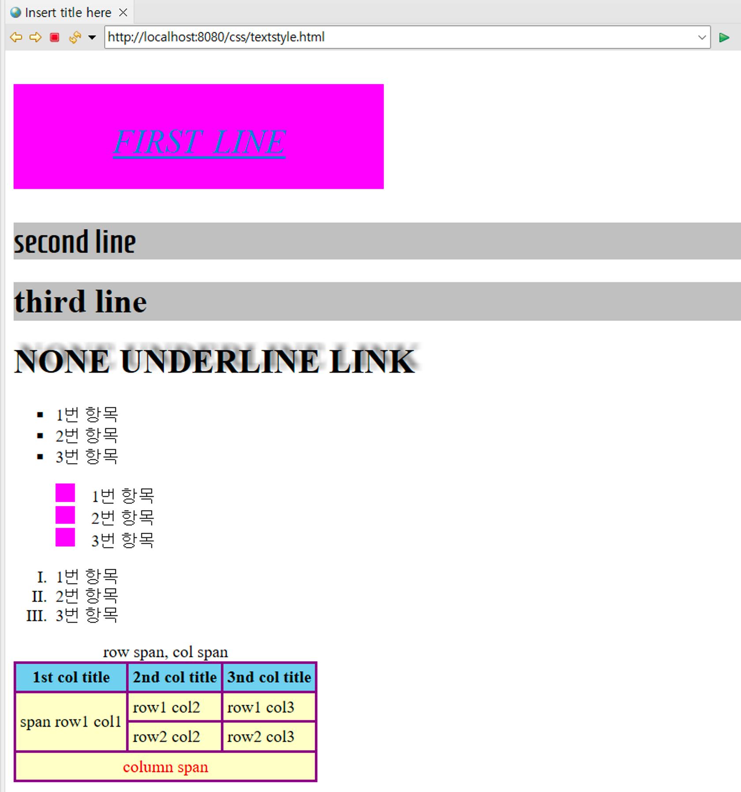
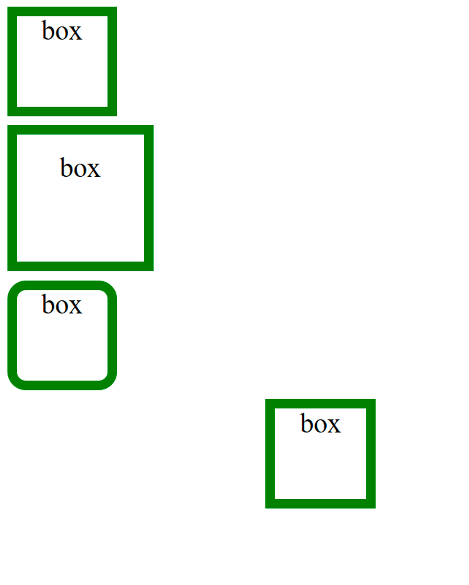

### HTML에 css 적용하는 방법

1. 인라인 방식
    - 엘리먼트 태그 내부 style 속성에 css 설정
    - eg) `<p style="color: blue; "> inline </p>`s
2. 내부파일 지정 방식
    - html 파일 내에 style 엘리먼트에 css 정의

        ```html
        <style type="text/css">
        	...
        </style>
        ```

3. 외부파일 지정 방식
    - css파일을 링크하여 스타일 적용, link 앨리먼트를 통해 특정 경로의 css 파일을 가져온다
    - eg) `<link href="my.css" rel="stylesheet">`

> css가 우선적용되는 순서는 인라인 방식, 내부파일 지정방식, 외부파일 지정방식 순이다
우선순위가 높은 스타일이 우선순위가 낮은 스타일을 덮어쓴다
>

## CSS 기본 문법

### 선택자(Selector)

Reference(MDN Document): css를 적용할 태그를 선택하는 문법이다.

[https://developer.mozilla.org/ko/docs/Web/CSS/CSS_Selectors](https://developer.mozilla.org/ko/docs/Web/CSS/CSS_Selectors)

1. 태그 선택자

    ```xml
    <style>
    	a {}
    </style>
    ```

2. id 선택자

   ```xml
   <style>
       #idname{}
   </style>
   ```

3. 클래스 선택자

    ```xml
    <style>
    	.classname{}
    </style>
    ```

   > **우선순위는 id선택자 > 클래스 선택자 > 태그 선택자**
   >

   > CSS 적용방식, 선택자를 통한 모든 우선순위를 무시하고 CSS 적용하기 위해서는 !important 속성을 사용할 수 있다
   >

   eg)

    ```xml
    <style>
       a {
       color:orange;
       }
       #apple {
       color:red;
       }
       .banana {
       color:yellow;
       }
    </style>
    ```

### 효과(Declaration)

선택된 태그를 어떻게 표현할 지 정하는 문법이다.

Reference(MDN Document) :

- text
  style : [https://developer.mozilla.org/ko/docs/Learn/CSS/Styling_text](https://developer.mozilla.org/ko/docs/Learn/CSS/Styling_text)
- css
  layout : [https://developer.mozilla.org/ko/docs/Learn/CSS/CSS_layout](https://developer.mozilla.org/ko/docs/Learn/CSS/CSS_layout)

> **상대단위 em, rem, %**
상대(relative) 단위란 고정되지 않고 어떤 기준에 따라서 유동적으로 바뀔 수 있는 길이를 나타내는 단위
- `em`  :  해당 단위가 사용되고 있는 요소의 폰트 사이즈
- `rem`  :  최상위 요소(html) 사용되고 있는 요소의 폰트 사이즈(16px), 0.5rem ⇒8px
- `%` : 최상위 요소(html) 사용되고 있는 요소의 폰트 사이즈는 100% 16px, 200% ⇒ 32px
```html
<!DOCTYPE html>
<html>
<head>
<meta charset="UTF-8">
<title>Insert title here</title>
<style type="text/css">
	@import url('https://fonts.googleapis.com/css2?family=Homenaje&display=swap');
	#target {
	font-family: none(브라우저에서 지원하지 않는 폰트라면 무시된다), sans-serif; 
	font-size: 3rem;
	font-style: italic; 
	font-weight: lighter; 
	font-variant: small-caps;
	color: #0085cf; /*HSV*/
	background: rgb(255,0,255); /*BGR */
	text-align: center;
	line-height: 100px;
	width: 50%;
	height: 100px;
	text-decoration: underline;
	}
	#googlefont{
	font-family: 'Homenaje', sans-serif;
	}
	.normal{
	background: silver;
	}
	#link {
	text-decoration: none;
	text-shadow: 5px -5px 5px gray; /* x y blur color */
	text-transform: uppercase;
	}
	ol {
	list-style-type: square;
	}
	ul {
	list-style-type: upper-roman;
	}
	#pinkol{
	list-style-image: url("/css/images/pinkol.png");
	list-style-position: inside;
	}
	table, td, th {
	border: 2px solid purple; 
	border-collapse: collapse;
	padding: 4px;
	}
	th {
	background: skyblue;
	}
	td {
	background: #FFFFCC;
	}
	tfoot {
	text-align: center;
	color: red;
	}
</style>
</head>
<body>
	<h1 id="target" class="normal">first line</h1>
	<h1 id="googlefont" class="normal">second line</h1>
	<h1 class="normal">third line</h1>
	<h1><a id="link">none underline link</a></h1>
	
	<ol>
		<li>1번 항목</li>
		<li>2번 항목</li>
		<li>3번 항목</li>
	</ol>
	
	<ol id="pinkol">
		<li>1번 항목</li>
		<li>2번 항목</li>
		<li>3번 항목</li>
	</ol>
	
	<ul>
		<li>1번 항목</li>
		<li>2번 항목</li>
		<li>3번 항목</li>
	</ul>
	
	<table>
		<caption>row span, col span</caption>
		<thead>
			<tr>
				<th>1st col title</th>
				<th>2nd col title</th>
				<th>3nd col title</th>
			</tr>
		</thead>
		<tbody>
			<tr>
				<td rowspan="2">span row1 col1</td>
				<td>row1 col2</td>
				<td>row1 col3</td>
			</tr>
			<tr>
				<td>row2 col2</td>
				<td>row2 col3</td>
			</tr>
		</tbody>
		<tfoot>
			<tr><td colspan="3">column span</td></tr>
		</tfoot>
	</table>
	
</body>
</html>
```


```html
<!DOCTYPE html>
<html>
<head>
<meta charset="UTF-8">
<title>Insert title here</title>
<style type="text/css">

	.base {
	width: 100px;
	height: 100px;
	border: 10px solid green;
	margin: 10px;
	text-align: center;
	font-size: 30px
	}

	.addpadding{
	padding: 20px;
	}
	
	.roundborder{
	border-radius: 20px;
	}
	
	.centeralign{
	margin-left: auto;
	margin-right: auto;
	}
	
	.unvisible{
	display: none;
	}

</style>
</head>
<body>
	<div class="base">box</div>
	<div class="base addpadding">box</div>
	<div class="base roundborder">box</div>
	<div class="base centeralign">box</div>
	<div class="base unvisible">box</div>
</body>
</html>
```



