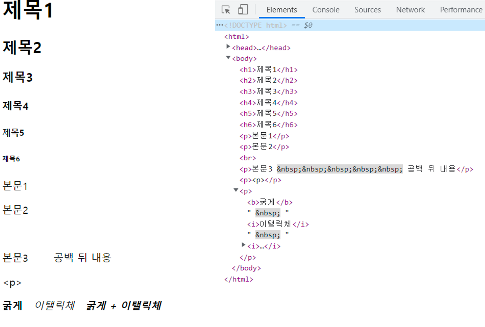
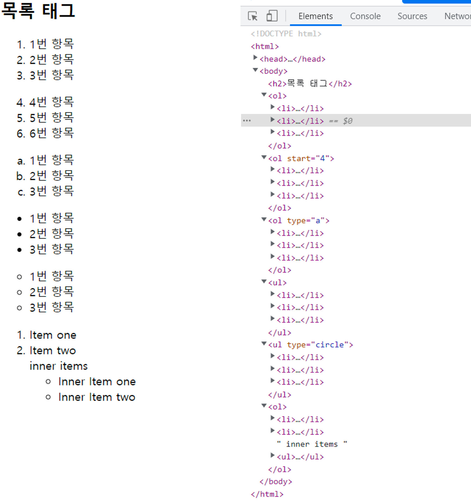
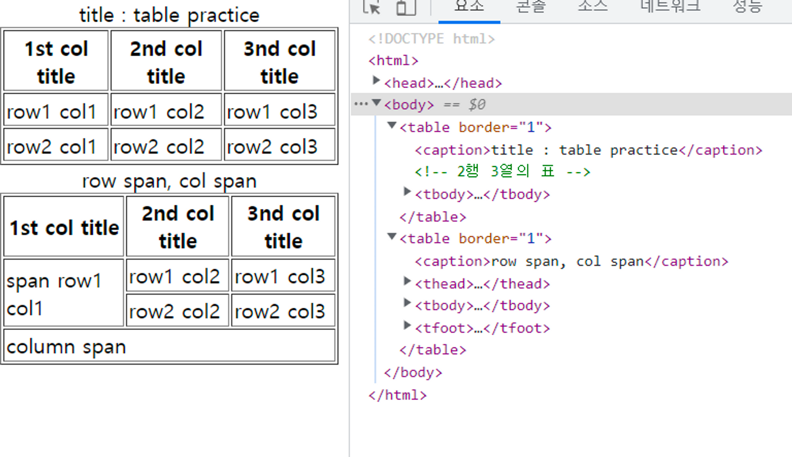
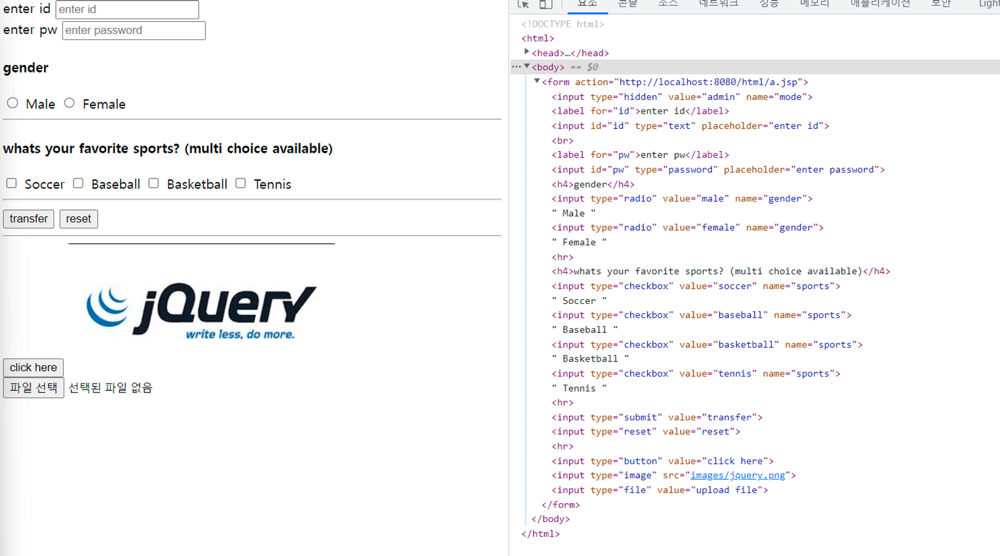

## html 기본 문서  만들기

### HTML

- Hyper text markup lagnuage
- 네트워크 상에서 http 프로토콜을 통해 전달되는 문서
- 컨텐츠와 컨텐츠를 표시할 구조만 표시하는 언어
- 컨텐츠를 표시할 구조인 마크(Mark)로 둘러싸인 언어.
- 확장자 → html, htm
    - 표시 규칙 → tag, attribute(속성)
    - 내용물 → contents
    - `<tag명 attribute명="attribute값">내용물</tag명>`
    - eg) `<h1 style="color: red">hello world</h1>`
        - tag : `<h1></h1>`
        - attribute : style=”color: red”
        - content : hello world

1. 텍스트 표현 태그
    - `<hn>` : 제목 표시 (h1 ~ h6)
    - `<p>` :  본문 표시
    - &nbsp; : 공백 표시
    - 부등호 표시 : `&lt`; → < , `&gt`; → >
    - 서체 속성 변경 : `<b>` → 굵게, `<i>` → 이탤릭체

    ```html
    <!DOCTYPE html>
    <html>
    <head>
    <meta charset="UTF-8">
    <title>Insert title here</title>
    </head>
    <body>
    	<h1>제목1</h1>
    	<h2>제목2</h2>
    	<h3>제목3</h3>
    	<h4>제목4</h4>
    	<h5>제목5</h5>
    	<h6>제목6</h6>
    	<p>본문1</p>
    	<p>본문2</p>
    	<br>
    	<p>본문3 &nbsp;&nbsp;&nbsp;&nbsp;&nbsp; 공백 뒤 내용</p>
    	<p>&lt;p&gt;</p>
    	<p>
    		<b>굵게</b> &nbsp;
    		<i>이탤릭체</i> &nbsp;
    		<i><b>굵게 + 이탤릭체</b></i>
    	</p>
    </body>
    </html>
    ```
    

2. 목록 태그
    - `<ol>` : 순서가 있는 목록
        - attributes
            - type :  순서 타입 변경 (default :  번호 형식)
            - start : 시작 순서 설정
    - `<ul>` : 순서가 없는 목록
        - attributes
            - type : 항목 모양 변경 가능 (default :  번호 형식)
    - `<li>` : 항목

    ```html
    <!DOCTYPE html>
    <html>
    <head>
    <meta charset="UTF-8">
    <title>Insert title here</title>
    </head>
    <body>
    	<h2>목록 태그</h2>
    	<ol>
    		<li>1번 항목</li>
    		<li>2번 항목</li>
    		<li>3번 항목</li>
    	</ol>
    	
    	<ol start="4">
    		<li>4번 항목</li>
    		<li>5번 항목</li>
    		<li>6번 항목</li>
    	</ol>
    	
    	<ol type="a">
    		<li>1번 항목</li>
    		<li>2번 항목</li>
    		<li>3번 항목</li>
    	</ol>
    	
    	<ul>
    		<li>1번 항목</li>
    		<li>2번 항목</li>
    		<li>3번 항목</li>
    	</ul>
    	
    	<ul type="circle">
    		<li>1번 항목</li>
    		<li>2번 항목</li>
    		<li>3번 항목</li>
    	</ul>
    	<ol>
    		<li>Item one</li>
    		<li>Item two</li>
    		inner items
    		<ul>
    		  <li> Inner Item one </li>
    		  <li> Inner Item two </li>
    		</ul>
    		
    
    	</ol>
    </body>
    </html>
    ```

    

3. 테이블 태그
    - `<table>` : 테이블 구조 생성
    - `<tr>` :  테이블 행
    - `<td>` : 테이블 열
        - rowspan : 행 병합, value: 병합할 행의 수
        - colspan :  열 병합, value: 병합할 열의 수
    - `<caption>`: 테이블 제목
    - `<th>` : `<tr>` 태그 내부에 사용하여 column의 제목
    - `<thead>`, `<tbody>`, `<tfoot>` : 명시적 테이블 header, body, tfoot

    ```html
    <!DOCTYPE html>
    <html>
    <head>
    <meta charset="UTF-8">
    <title>Insert title here</title>
    </head>
    <body>
    	<table border="1">
    		<caption>title : table practice</caption>
    		<!-- 2행 3열의 표 -->
    		<tr>
    			<th>1st col title</th>
    			<th>2nd col title</th>
    			<th>3nd col title</th>
    		</tr>
    		<tr>
    			<td>row1 col1</td>
    			<td>row1 col2</td>
    			<td>row1 col3</td>
    		</tr>
    		<tr>
    			<td>row2 col1</td>
    			<td>row2 col2</td>
    			<td>row2 col3</td>
    		</tr>
    	</table>
    	
    	<table border="1">
    		<caption>row span, col span</caption>
    		<thead>
    			<tr>
    				<th>1st col title</th>
    				<th>2nd col title</th>
    				<th>3nd col title</th>
    			</tr>
    		</thead>
    		<tbody>
    			<tr>
    				<td rowspan="2">span row1 col1</td>
    				<td>row1 col2</td>
    				<td>row1 col3</td>
    			</tr>
    			<tr>
    				<td>row2 col2</td>
    				<td>row2 col3</td>
    			</tr>
    		</tbody>
    		<tfoot>
    			<tr><td colspan="3">column span</td></tr>
    		</tfoot>
    	</table>
    </body>
    </html>
    ```

    

4. 멀티미디어 태그
    - ``,`<audio>`,`<video>`
        - common attributes
            - src : 소스 경로
        - `` :  소스로부터 이미지 로드
            - 확장자 : jpeg, jpg, png …
            - alt : 소스로부터 이미지 로드 실패 시 텍스트의 형태로 노출
            - width : 이미지의 가로 길이 설정
            - height: 이미지의 높이 설정
        - `<audio>` :  소스로부터 오디오 로드
            - 확장자 : mp3 …
            - control: 컨트롤러 표시
            - autoplay : html페이지 로딩시 자동 음악 재생
            - loop : 자동재생

                > 참고 : chrome 브라우저에서는 지원하지 않는 속성(개인정보 보안 문제)
                > 
        - <video> 소스의 video 재생
        - 확장자 : mp4 …
        - control: 컨트롤러 표시
        - width, height
        - poster : 재생되기 전에 표시할 이미지(썸네일)
5. 하이퍼링크 태그
    - `<a>` 태그 :  클릭 시 지정한 url(혹은 현재 문서의 특정 태그 위치, 태그의 id 또는 class를 통해 명시)로 이동하는 하이퍼링크 생성
        - href : 이동할 url

6. 폼 관련 태그
    - `<form>`
        - action : 입력받은 데이터를 전달(백앤드, JSP, 서블릿)
    - `<lable>` : input 엘리먼트에 대한 설명
        - for : input 엘리먼트의 id 속성값과 연결하여 포커스
    - `<input>`
        - type : 입력 받는 데이터 타입,
            - text, password, hidden, radio, submit …

                [https://developer.mozilla.org/ko/docs/Web/HTML/Element/Input](https://developer.mozilla.org/ko/docs/Web/HTML/Element/Input) 
                
            - submit:  form태그의 액션으로 전송한다.
            - hidden: 사용자에게 보이지 않게 value 전송
            - submit: 데이터를 전달하여 form의 action을 실행한다
            - image :  이미지 소스를 입력하여 이미지를 로드 하고 클릭 시 submit
            - reset : form태그 내부에 입력된 모든 값(inputs)들을 초기화 한다
            - maxLength : 최대 길이 설정
            - readOnly : 입력, 수정 불가 하도록 설정
            - required : 필수 입력 필드로 설정
            - pattern : 정규표현식(Regex)을 통한 입력값 validation → eg) 영문자, 숫자의 5~10글자 ⇒ `[A-z0-9]{5,10}`
        - value: 값을 지정할 수 있다

    ```html
    <!DOCTYPE html>
    <html>
    <head>
    <meta charset="UTF-8">
    <title>Insert title here</title>
    </head>
    <body>
    	<form action="http://localhost:8080/html/a.jsp">
    		<input type="hidden" value="admin" name="mode">
    		
    		<label for="id">enter id</label>
    		<input id="id" type="text" placeholder="enter id">
    		<br>
    		<label for="pw">enter pw</label>
    		<input id="pw" type="password" placeholder="enter password">
    	
    		
    		<h4>gender</h4>
    		<input type="radio" value="male" name="gender"> Male
    		<input type="radio" value="female" name="gender"> Female
    		<hr>
    		<h4>whats your favorite sports? (multi choice available)</h4>
    		<input type="checkbox" value="soccer" name="sports"> Soccer
    		<input type="checkbox" value="baseball" name="sports"> Baseball
    		<input type="checkbox" value="basketball" name="sports"> Basketball
    		<input type="checkbox" value="tennis" name="sports"> Tennis
    		<hr>
    		<input type="submit" value="transfer">
    		<input type="reset" value="reset">
    		
    		<hr>
    		<input type="button" value="click here">
    		<input type="image" src="images/jquery.png">
    		<input type="file" value="upload file">
    	</form>
    </body>
    </html>
    ```
   

    ### ‼️MarkDown이란 ? 
    > markdown 언어
    markdown 언어는 markup 언어의 일종으로 컨텐츠를 표시할 구조에 해당하는 html 태그를 특정의 문자로 대체한 언어이다.
    eg) `<h1>` → `#`
>
